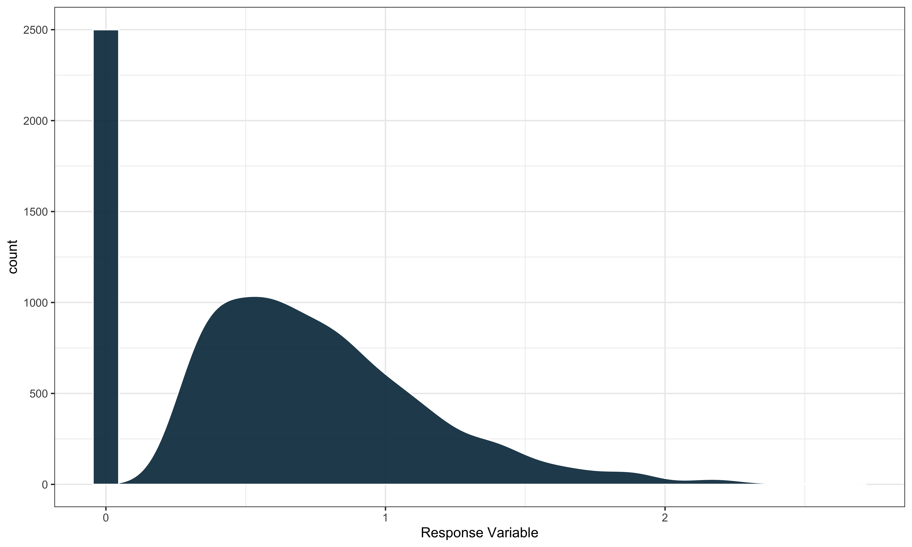

<!-- README.md is generated from README.Rmd. Please edit that file -->
<!-- badges: start -->

[](https://github.com/harvard-ufds/saeczi/actions/workflows/R-CMD-check.yaml)
[](https://CRAN.R-project.org/package=saeczi)
<!-- badges: end -->

# saeczi

### (Small Area Estimation for Continuous Zero Inflated data)

## Overview

`saeczi` is an R package that implements a small area estimator that
uses a two-stage modeling approach for zero-inflated response variables.
In particular, we are working with variables that follow a
semi-continuous distribution with a mixture of zeroes and positive
continuously distributed values. An example can be seen below.



`saeczi` first fits a linear mixed model to the non-zero portion of the
response and then a generalized linear mixed model with binomial
response to classify the probability of zero for a given data point. In
estimation these models are each applied to new data points and combined
to compute a final prediction.

The package can also generate MSE estimates using a parametric bootstrap
approach described in Chandra and Sud (2012) either in parallel or
sequentially.

## Installation

Install the latest CRAN release with:

``` r
install.packages("saeczi")
```

You can also install the developmental version of `saeczi` from GitHub
with:

``` r
# install.packages("pak")
pak::pkg_install("harvard-ufds/saeczi")
```

## Usage

We’ll use the internal package data to show an example of how to use
`saeczi`. The two data sets contained within the package contain example
forestry data collected by the Forestry Inventory and Analysis (FIA)
research program.

- `saeczi::samp`: Example FIA plot-level sample data for each county in
  Oregon.
- `saeczi::pop`: Example FIA pixel level population auxiliary data for
  each county in Oregon.

The main response variable included in `samp` is above ground live
biomass and our small areas in this case are the counties in Oregon. To
keep things simple we will use tree canopy cover (tcc16) and elevation
(elev) as our predictors in both of the models. We can use `saeczi` to
get estimates for the mean biomass in each county as well as the
corresponding bootstrapped (B = 500) MSE estimate as follows.

``` r
library(saeczi)
data(pop)
data(samp)

result <- saeczi(samp_dat = samp,
                 pop_dat = pop, 
                 lin_formula =  DRYBIO_AG_TPA_live_ADJ ~ tcc16 + elev,
                 log_formula = DRYBIO_AG_TPA_live_ADJ ~ tcc16,
                 domain_level = "COUNTYFIPS",
                 mse_est = TRUE,
                 B = 1000L)
```

#### Return

The function returns the following objects:

| Name      | Description                                                               |
|:----------|:--------------------------------------------------------------------------|
| `call`    | The original function call                                                |
| `res`     | A data.frame containing the estimates                                     |
| `lin_mod` | The linear model object of class `merMod` used to compute the estimates   |
| `log_mod` | The logistic model object of class `merMod` used to compute the estimates |

As there are 36 total counties in Oregon, we will just look at the first
few rows of the results:

``` r
result$res |> head()
#>   COUNTYFIPS        mse       est
#> 1      41001   38.30647  14.57288
#> 2      41003  122.90662 103.33016
#> 3      41005 1069.30963  86.08616
#> 4      41007 4691.01214  78.79615
#> 5      41009  356.53805  73.98920
#> 6      41011  273.34697  90.44174
```

### Parallelization

`saeczi` supports parallelization through the `future` package to speed
up the bootstrapping process, but requires a small amount of additional
work on the part of the user. It is not enough just to specify
`parallel = TRUE` in the function signature as a `future::plan` must
also be specified.

Below is an example that uses multisession’ future resolution with 6
threads:

``` r
future::plan("multisession", workers = 6)
result_par <- saeczi(samp_dat = samp,
                     pop_dat = pop, 
                     lin_formula =  DRYBIO_AG_TPA_live_ADJ ~ tcc16 + elev,
                     log_formula = DRYBIO_AG_TPA_live_ADJ ~ tcc16,
                     domain_level = "COUNTYFIPS",
                     mse_est = TRUE,
                     parallel = TRUE,
                     B = 1000L)
```
