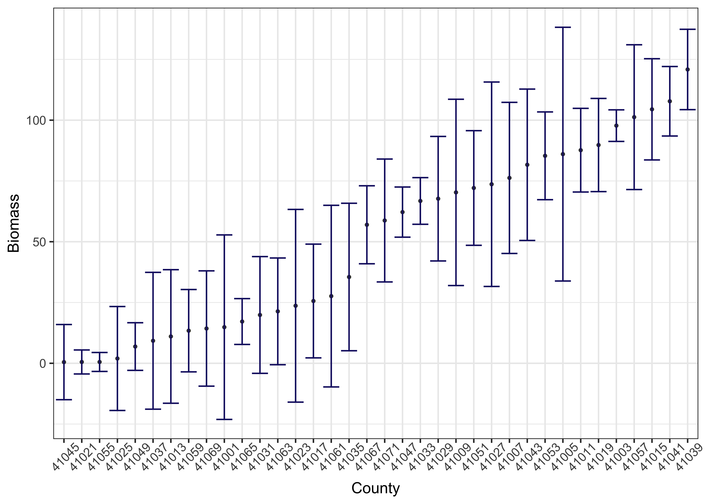

<!-- README.md is generated from README.Rmd. Please edit that file -->

# saeczi

### (Small Area Estimation for Continuous Zero Inflated data)

<!-- badges: start -->
[](https://github.com/harvard-ufds/saeczi/actions/workflows/R-CMD-check.yaml)
<!-- badges: end -->

## Overview

`saeczi` is an R package that implements a small area estimator that
uses a two-stage modeling approach for zero-inflated response variables.
In particular, we are working with variables that follow a
semi-continuous distribution with a mixture of zeroes and positive
continuously distributed values. An example can be seen below.


`saeczi` first fits a linear mixed model to the non-zero portion of the
response and then a generalized linear mixed model with binomial
response to classify the probability of zero for a given data point. In
estimation these models are each applied to new data points and combined
to compute a final prediction.

The package can also generate MSE estimates using a parametric bootstrap
approach described in Chandra and Sud (2012) either in parallel or
sequentially.

## Installation

You can install the developmental version of `saeczi` from GitHub with:

``` r
# install.packages("pak")
pak::pkg_install("harvard-ufds/saeczi")
```

## Usage

We’ll use the internal package data to show an example of how to use
`saeczi`. The two data sets contained within the package contain example
forestry data collected by the Forestry Inventory and Analysis (FIA)
research program.

- `saeczi::samp`: Example FIA plot-level sample data for each county in
  Oregon.
- `saeczi::pop`: Example FIA pixel level population auxiliary data for
  each county in Oregon.

The main response variable included in `samp` is above ground live
biomass and our small areas in this case are the counties in Oregon. To
keep things simple we will use tree canopy cover (tcc16) and elevation
(elev) as our predictors in both of the models. We can use `saeczi` to
get estimates for the mean biomass in each county as well as the
corresponding bootstrapped (B = 500) MSE estimate as follows.

``` r
library(saeczi)
data(pop)
data(samp)

result <- saeczi(samp_dat = samp,
                 pop_dat = pop, 
                 lin_formula =  DRYBIO_AG_TPA_live_ADJ ~ tcc16 + elev,
                 log_formula = DRYBIO_AG_TPA_live_ADJ ~ tcc16 + elev,
                 domain_level = "COUNTYFIPS",
                 mse_est = TRUE,
                 B = 500,
                 parallel = FALSE)
#> ================================================================================
#> • Fitting Models...
#> • Beginning Bootstrap...
#>                                                                   - Fitting to Bootstrap samples ✓
#>                                       - Estimating MSE ✓
#> • Compiling Results...
#> ================================================================================
```

The function returns the original call, a data frame containing the
estimates, a log of any modeling warnings and messages from the
bootstrap procedure, as well as the linear and logistic model objects
used to compute the estimates.

``` r
names(result)
#> [1] "call"          "res"           "bootstrap_log" "lin_mod"      
#> [5] "log_mod"
```

As there are 36 total counties in Oregon, we will just look at the first
few rows of the results:

``` r
result$res |> head()
#>   domain       mse      est
#> 1  41001 173.58940 14.85495
#> 2  41003  42.43279 97.74967
#> 3  41005 581.01815 86.02207
#> 4  41007  35.98329 76.24752
#> 5  41009 222.58951 70.28624
#> 6  41011 213.38928 87.65072
```

This output format allows for easy results plotting


